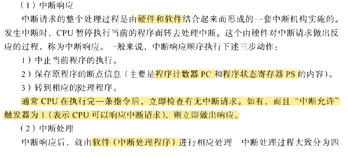
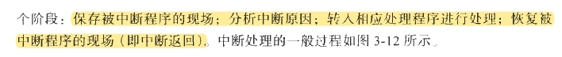

### 进程和CPU

1. 缓冲是buffer,缓存是cache；[详细对比的参考链接](https://blog.csdn.net/stpeace/article/details/69055053)

### 处理机调度

1. 周转时间是从提交到完成的时间；响应时间是从提交到响应的时间

- 
- 

### 存储管理

1. `页表也是需要硬件支持的`。逻辑地址转化为物理地址的过程是【硬件转化过程，这里没有考虑页面调度】：用页号p去检索页表，从页表得到该页的物理块号，把它装入`物理地址寄存器`中。同时，将页内地址d直接送入物理地址寄存器的块内地址字段中。这样，物理地址寄存器中的内容就是由两者拼接成的实际访问内存地址，从而完成了从逻辑地址到物理地址的转换。

### 设备

1. `DMA是硬件`。DMA传送的思想是：用`硬件机构`来实现`中断服务程序`所要完成的功能。

?> 1. 传送控制方式：程序直接控制方式、中断控制方式、DMA控制方式、通道控制方式  
2. 层次结构：程序驱动器、中断处理器、设备控制器、设备  
3. 缓冲：用硬件寄存器或在内存中专门划分出一块内存空间来存放输入输出的数据。  
4. DMA是磁盘->(缓冲区->)内存  
5. SPOOLing是：虚拟设备（独占设备-> 共享设备）  
6. 设备无关性是：用户程序应与实际使用的物理设备无光，由操作系统考虑不同驱动程序之间的问题。  
