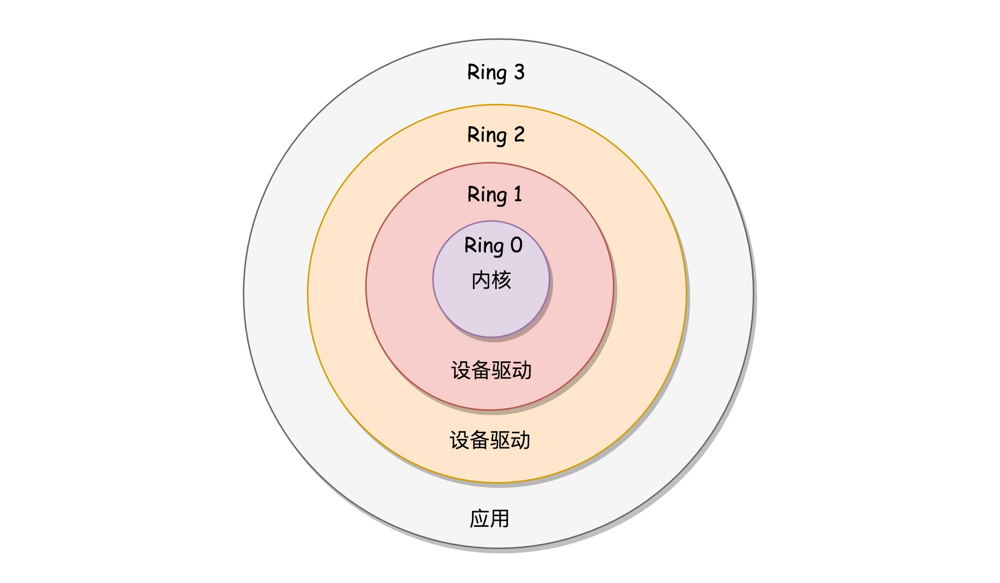

一个完整的计算机系统是由硬件和软件两大部分组成的。

在所有的软件中，`操作系统（Operating System）`占有特殊的地位，它是配置在计算机硬件上的第一层软件，它能控制硬件的工作，管理计算机系统的各种资源，并为系统中各个程序的运行提供服务。`(承上启下)`

### 1.1.1 计算机硬件结构

**特权指令和CPU工作模式:**

`指令`是控制计算机执行某种操作（如加、减、传送、转移等）的命令。一台计算机所能执行的全部的指令的集合称为`指令系统`或`指令集`。不同型号的CPU有着`不同的指令集`，也就是说，指令集与计算机系统密切相关，没有可移植性。(即：不同型号的CPU处理器架构不一样，`处理器架构是用硬件电路实现的指令集`)

在指令集中，有一类指令称为`特权指令`，主要用于系统资源的分配和管理，包括改变系统的工作方式，检测用户的访问权限，控制I/O设备动作等。（`root用户也不能使用特权指令`）

多数CPU都提供两种运行模式：`内核态`（又称核心态、系统态、`管态`）和`用户态`（又称`目态`）。这是为了保护操作系统程序（特别是内核部分）免受用户程序的干扰和损害。在`用户程序`在机器上运行时（`root用户`和非root用户），`CPU处于用户态`，权限比较低，只能执行非特权指令。当发生中断或系统调用时，CPU状态转为内核态，这样子就可以执行全部指令(包括特权指令)。

### 1.1.2 系统初启一般过程

打开操作系统后，计算机就开始初启过程，初启的目的是：`将操作系统的副本读入内存，建立正常的运行环境。`

对于Intel i386系类来说，初启过程分为以下步骤：

1. 硬件检测
2. 加载引导程序
3. 初始化内核
4. 实现用户登陆

### 1.1.3 什么是操作系统

操作系统没有统一的定义，你可以认为操作系统`承硬件启软件`,以下的要点可以帮助你更加理清操作系统是什么。

- 操作系统作为拓展机器  
  
通常把`裸机`（只有硬件的计算机）之上`覆盖各种软件`，从而形成功能更强的计算机称为`拓展机器`或`虚拟机`。操作系统能让`应用程序和用户`不用和硬件打交道。

- 操作系统作为资源管理器  
  
操作系统管理各种资源，并为上层的软件提供这些资源。

### 1.1.4 操作系统软件分类

**软件分类**：

按照所起的作用和需要的运行环境，软件通常可以分为三大类：系统软件、应用软件和支撑软件。

`系统软件`对计算机的`资源进行控制和管理`，并为用户和其他程序提供服务。

- 系统软件包括：
  - 操作系统（Windows、Linux）
  - 编译程序（C/C++、Java）
  - 汇编程序（Intel 8080、8086）
  - 连接装配程序（Loader）
  - 数据库管理系统（SQL 2000、Oracle）
  - 网络软件（IE、软性杀毒软件）

应用软件是为了解决某一特定的问题而设计的软件。

- 应用软件包括：
  - 图形软件（PS）
  - 软件包（rpm）

支撑软件是辅助软件技术人员从事`软件开发工作`的软件。

- 支撑软件
  - IDEA

### ✔😊1.1.5 操作系统的特征和服务

**操作系统的特征：**

- 并发性

并发性是指两个或多个进程在用一给定的时间间隔中进行（发）。  
【拓展：并行是同一时间要同时运行（行）】

- 共享性

被共享的程序必须是纯码（是指在执行过程中，本身不作变化的代码，通常是由指令和参数组成）

- 异步性

【拓展：同步异步、阻塞非阻塞参考资料：<https://www.zhihu.com/question/19732473>】  
【同步异步对于回答消息方(`对方`)而言，阻塞非阻塞相对本身进程（`本身`）而言】

- ✔😊抽象性

抽象性是把复杂事情简单化的有效方式。操作系统对硬件和软件资源进行了高度抽象话，`如CPU到进程的抽象、物理内存到地址空间（虚拟内存）的抽象以及磁盘到文件的抽象等`。

**操作系统提供的服务：**

操作系统提供两种基本的服务：系统调用和系统程序。

- 系统调用

系统调用使用户态转变为内核态。

- 系统程序

系统程序`不是`操作系统的组成部分。

最重要的系统程序是`命令解释器shell`
